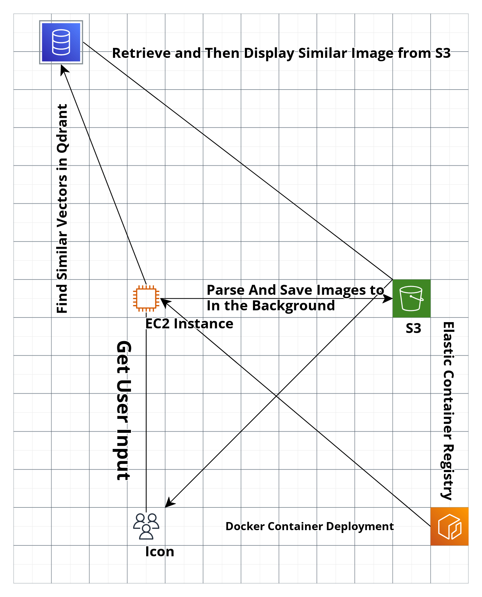

# Qdrant Image Similarity Search

Qdrant is a powerful image similarity search engine designed to efficiently find similar images based on vector representations. This project focuses on providing a scalable and efficient solution for image similarity search, allowing users to input an image and retrieve visually similar images from a large dataset.

## How Qdrant Works

Qdrant operates by representing images as vectors in a high-dimensional space. These vectors are obtained through advanced techniques such as deep learning. Once the vector representation is established, Qdrant utilizes similarity search algorithms to efficiently find images with similar vector representations.

### Project Overview

This project revolves around the similarity search of images. Here's a breakdown of the key functionalities:

1. **Daily Data Parsing:**
   - Every day, new data is parsed and processed.
   - The parsed data, including vector representations of images, is stored in the Qdrant dataset.

2. **Dockerization and Deployment:**
   - The application is Dockerized for easy deployment and scalability.
   - Docker images are pushed to Amazon Elastic Container Registry (ECR).
   - From ECR, the Dockerized application is deployed to Amazon EC2 instances.

3. **User Interaction:**
   - Users can input an image for similarity search through the application.
   - The application finds similar vectors in the Qdrant dataset.
   - Similar images are retrieved from Amazon S3, where images are stored for inference.

4. **Background Process:**
   - In the background, the application performs daily tasks, including parsing new data.
   - New data, along with image vectors, is stored in Qdrant for continuous improvement of the similarity search.

## AWS Architecture

The AWS architecture diagram illustrates the workflow of the Qdrant Image Similarity Search application:

1. **Dockerization and Deployment:**
   - The application is Dockerized and pushed to Amazon ECR.
   - From ECR, it is deployed to Amazon EC2 instances.

2. **Daily Tasks:**
   - Daily tasks, such as data parsing and updating Qdrant, are scheduled using cron/systemd.

3. **User Input and Similarity Search:**
   - Users input images for similarity search.
   - Qdrant performs vector similarity search, retrieving similar images from Amazon S3.

4. **Continuous Improvement:**
   - Daily tasks contribute to the continuous improvement of Qdrant's dataset and inference capabilities.

## Getting Started

To use Qdrant for image similarity search, follow these steps:

1. **Configure `config.py`:**
   - Before running the application, make sure to configure the `config.py` file in the root directory.
   - Update the necessary settings such as `region`, `repository_name`, `image_tag`, `account_id`, and any other relevant configurations.

2. **Run Scripts in the `AWS` Folder:**
   - Navigate to the `AWS` folder in your terminal.
   - Execute the necessary scripts for setting up and running your AWS infrastructure.
   - If applicable, consider creating an EC2 instance manually on the AWS website for better control.

3. **Supervisord Configuration:**
   - The application uses `supervisord.conf` to manage multiple tasks within the Docker container.
   - Check the `supervisord.conf` file to understand how tasks are orchestrated and managed.

4. **Streamlit Website:**
   - Once everything is set up, a Streamlit website will be displayed.
   - Access the website to interact with the image similarity search functionality.

## Acknowledgments

- [AWS Documentation](https://docs.aws.amazon.com/): The comprehensive documentation provided by Amazon Web Services has been instrumental in setting up and understanding AWS services.

- [Boto Documentation](https://boto3.amazonaws.com/v1/documentation/api/latest/index.html): The official Boto documentation has been a valuable reference for interacting with AWS services programmatically.

- [Qdrant Documentation](https://qdrant.readthedocs.io/en/latest/): The Qdrant documentation has provided insights into the design and functionality of Qdrant, aiding in the development of our image similarity search application.
